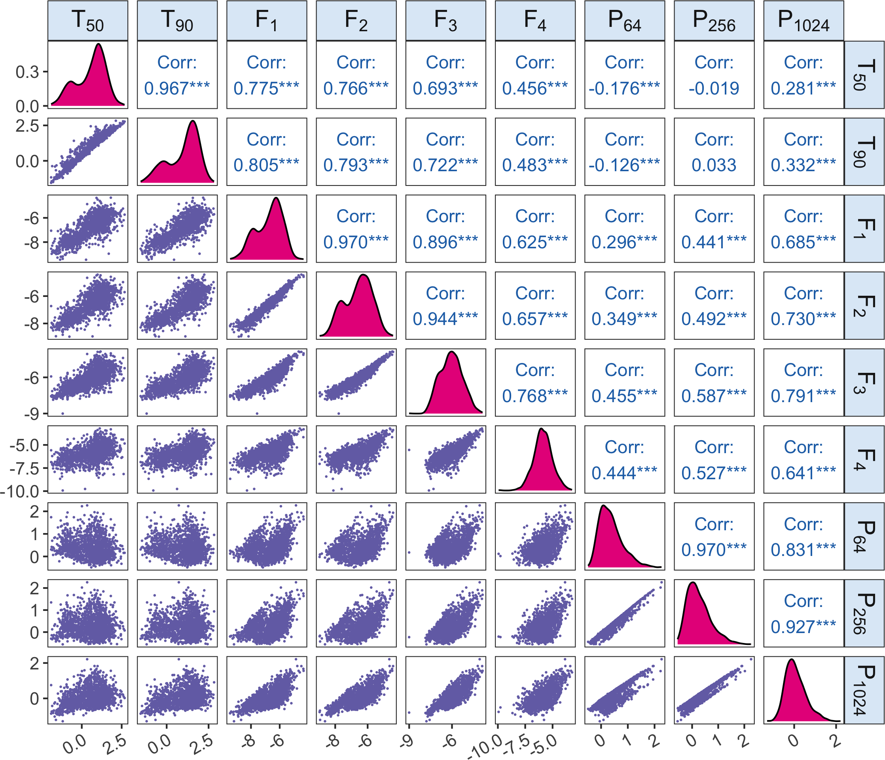
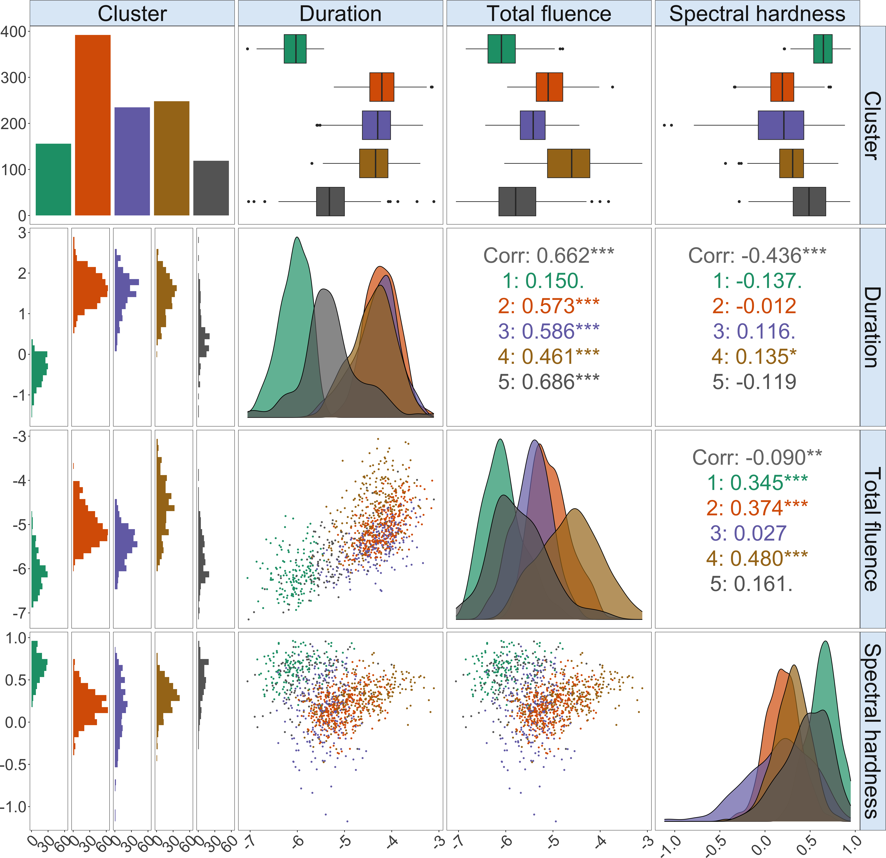

```{r setup, include = FALSE}
knitr::opts_chunk$set(
  warning = FALSE, message = FALSE, error = FALSE,
  collapse = TRUE, comment = "#>", out.width = "100%",
  fig.path = "figures/"
)
```

This project applies the Gaussian mixture of factor analyzers to cluster and characterize the gamma-ray bursts (GRBs) from the Burst and Transient Source Experiment (BATSE) 4Br Catalog. 

The following star coordinates plot displays the five estimated simple GRB clusters, and the densities and scatter plots show the properties of the GRB clusters in terms of three composite features, duration ($T_{90}$), total fluence ($F_1 + F_2 + F_3 +F_4$) and spectral hardness ($F_3/(F_1 +F_2$)).

<p float="left">


</p>

