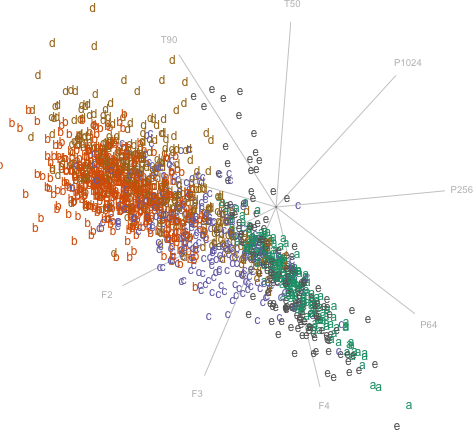
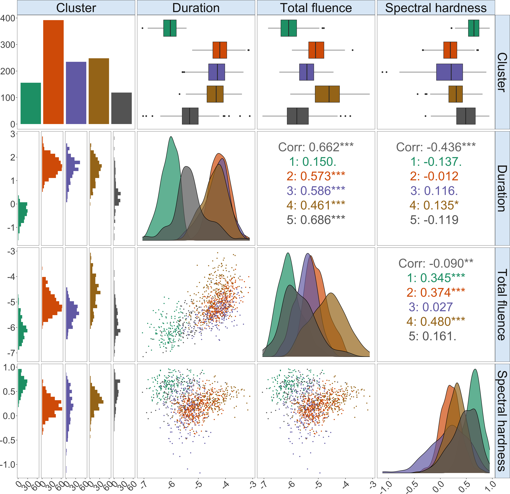

Cluster Analysis and Variability Characterization of BATSE Catalog Gamma
Ray Bursts with Gaussian Mixture of Factor Analyzers
================

This project applies Gaussian mixtures of factor analyzers to cluster
and characterize gamma-ray bursts (GRBs) from the Burst and Transient
Source Experiment (BATSE) 4Br Catalog.

The star-coordinate plot below displays the five estimated simple GRB
clusters. The density and scatter plots further illustrate the cluster
characteristics in terms of three composite features: duration
($T_{90}$), total fluence ($F_1 + F_2 + F_3 + F_4$), and spectral
hardness $\displaystyle F_3/(F_1 + F_2)$.

