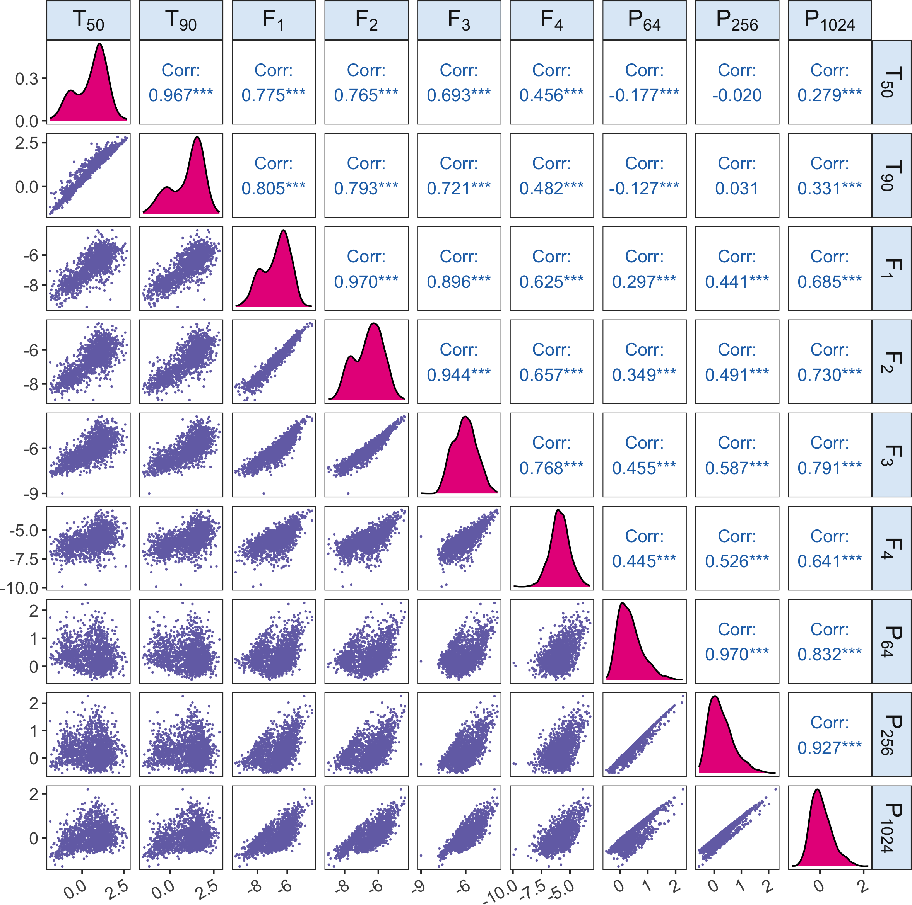

Latent characterisation of the BATSE Gamma Ray Bursts catalogue using
Gaussian Mixture of Factor Analysers and Model-estimated Overlap-Based
Syncytial Clustering
================

This project applies the Gaussian mixture of factor analyzers (MixFAD)
and the Model-estimated Overlap-Based Syncytial Clustering (MOBSynC) to
cluster and characterize the gamma-ray bursts (GRBs) from the Burst and
Transient Source Experiment (BATSE) 4Br Catalog.

The following figures display the densities and scatter plots for the
1598 BATSE Catalog GRBs with nine fully observed parameters ($\log_{10}$
transformed), and the densities and scatter plots for the thinned sample
including 1150 GRBs with moderate or high degree of certainty in their
observed values determined by the associated measurement errors, which
show the properties of the estimated GRB clusters in terms of three
composite features, duration ($T_{90}$), total fluence
($F_1 + F_2 + F_3 +F_4$) and spectral hardness
($H_{321} = F_3/(F_1 +F_2$)).

